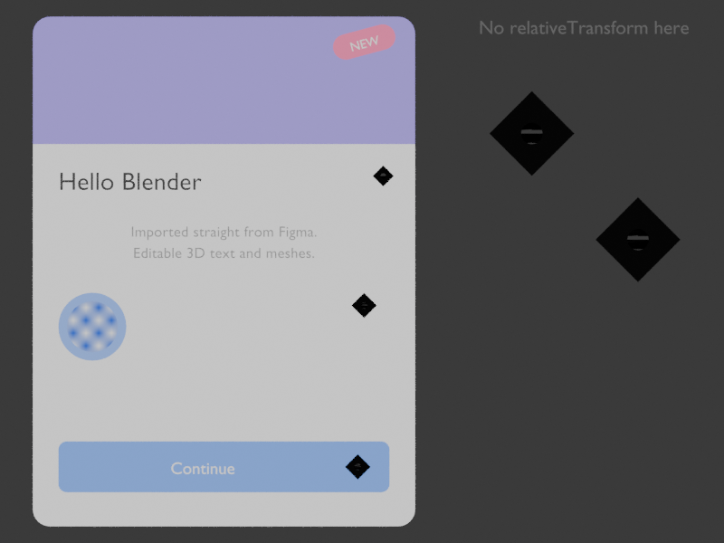

# Figma to Blender

A Blender add-on that imports a **Figma page as editable 3D UI**: text becomes Blender text
objects, rectangles and ellipses become rounded meshes, icons become SVG curves (or textured
planes), image fills become textured planes, and Figma frames/groups become parented Empties,
so you can grab a whole card or menu and move it in 3D.

It talks to the Figma REST API directly from Blender (standard library only, no `requests`),
and the same pure-Python core also runs as a CLI so a page can be exported once to an offline
**scene bundle** (`scene.json` + `assets/`) and imported reproducibly later.



## Install

**Blender 4.2+ (extension):** zip the `figma_to_blender/` folder (the zip must contain the
folder with `blender_manifest.toml` inside it) and drag the zip into Blender, or use
*Edit ▸ Preferences ▸ Get Extensions ▸ ⌄ ▸ Install from Disk*.

**Blender 3.6 - 4.1 (legacy add-on):** zip the same folder and use
*Edit ▸ Preferences ▸ Add-ons ▸ Install…*, then enable *Import-Export: Figma to Blender*.

```sh
cd <repo>
zip -r figma_to_blender.zip figma_to_blender -x '*__pycache__*'
```

## Get a Figma token

Figma ▸ account menu ▸ *Settings* ▸ *Security* ▸ *Personal access tokens* ▸ *Generate new token*
with the **File content: read** scope. Paste it into *Edit ▸ Preferences ▸ Add-ons ▸ Figma to
Blender ▸ Personal access token* (or set the `FIGMA_TOKEN` environment variable). You need at
least view access to the file you import.

## Use in Blender

Open the 3D Viewport sidebar (`N`) ▸ **Figma** tab.

1. Paste the file URL (`https://www.figma.com/design/<key>/...`) or bare file key.
2. **Fetch pages**, then pick a page from the dropdown.
3. Choose options:
   - **Icons**: *SVG curves* or *Image planes* (see below).
   - **Orientation**: *Upright (XZ)*, the UI faces -Y like the front view, or *Flat (XY)*.
   - **Scale**: metres per Figma px (default `0.001`, a 360 px card is 36 cm wide).
   - **Depth step**: offset per element in draw order so overlapping shapes never z-fight
     (later-drawn = in front).
   - **Icon max size**, **Raster scale**, **Center at origin**.
4. **Import page**. A new collection named after the page appears, with one Empty per Figma
   frame/group and children parented to it. Every object carries `figma_id`, `figma_type`,
   `figma_name` custom properties; text whose font was not found gets `figma_font`.

**Offline bundle** box: *Export bundle to folder* fetches without building; *Import bundle*
builds from a folder written earlier by the add-on or the CLI.

The operator prints a summary (counts per kind, fonts not found, warnings) to the status bar
and full warnings to the system console.

## CLI

Runs with plain CPython 3.8+ (no Blender needed):

```sh
export FIGMA_TOKEN=figd_...
python -m figma_to_blender.cli --file https://www.figma.com/design/<key>/Name --list-pages
python -m figma_to_blender.cli --file <key> --page "Page 1" --out ./bundle \
    --icon-format svg --raster-scale 2 --icon-max-size 128
```

Then in Blender: *Offline bundle ▸ Import bundle* pointing at `./bundle`, or from a script:

```python
import sys; sys.path.append("/path/to/repo")
from figma_to_blender import builder
report = builder.build_bundle("./bundle", builder.BuildOptions(icon_mode="SVG"))
print(report.summary())
```

## How it works

```
Figma REST API ──► figma_api.py ──► scene_model.py ──► scene.json + assets/ ──► builder.py ──► Blender objects
                   (urllib only)     (pure Python)        (the "bundle")          (bpy)
```

- `GET /v1/files/{key}?depth=1` lists pages; `GET /v1/files/{key}/nodes?ids=<page>&geometry=paths`
  fetches the tree with `size` + `relativeTransform`, which are composed down from the page
  root so nested and rotated frames land where Figma shows them (falls back to
  `absoluteBoundingBox` when missing).
- Icons and image fills are rendered by `GET /v1/images/{key}` in batches of 40 with retry/backoff
  on 429; a failed render is logged and skipped, never fatal.
- `scene.json` is a flat draw-ordered list of `text | rect | ellipse | icon | image | group`
  elements with world transform, size, first visible fill, opacity, corner radii and text style.

### Icon detection and SVG vs planes

A node is an icon when it is a `VECTOR`, `BOOLEAN_OPERATION`, `STAR`, `LINE` or
`REGULAR_POLYGON`, **or** a `GROUP`/`FRAME`/`INSTANCE`/`COMPONENT` no larger than *Icon max
size* (default 128 px) whose descendants are all vector-like (no text, no image fills). Icons
are exported as one unit and their children are not imported separately. Everything larger
recurses into its children as a group. A node whose first visible fill is an image is imported
as an image plane.

| | SVG curves | Image planes |
|---|---|---|
| Editable / extrudable | yes, real curve objects | no |
| Resolution | independent | fixed (`raster scale` × node size) |
| Gradients, shadows, blend modes | lost (flat fills only) | pixel-perfect |
| Scene weight | heavy for complex icons | one quad + texture |

Curves come from Blender's bundled SVG importer. The add-on does not trust its 90 dpi scale:
it measures the importer's px→metre factor once, then scales each icon so the SVG viewBox
matches the node size exactly (falling back to bounding-box fitting for SVGs without a
viewBox). If the importer is unavailable, icons fall back to planes with a warning.

## Limitations (v0.1)

- Gradients are approximated by a single averaged colour (`fill_approx` flag / `figma_fill_approx`
  property); image fills on shapes other than the first fill are ignored.
- Strokes, effects (shadows, blurs), blend modes and masks are not imported (they do survive
  inside PNG icons/images).
- Fonts must be installed locally; the add-on matches by PostScript name, then family + weight.
  Otherwise Blender's default font is used and the family is recorded in `figma_font`.
- Text vertical metrics are approximated (ascender ≈ 0.8 em); mixed styles within one text
  node (`characterStyleOverrides`) are not supported, the whole node uses its base style.
- Component variants and instances are imported as they appear; auto-layout is baked to
  absolute positions (as the API reports them).
- Only the first visible fill of each node is used; `clipsContent` is ignored.

## Roadmap

- Strokes as outline curves / inset meshes, drop shadows as translucent planes.
- Real gradients via colour-ramp shader nodes.
- Per-run text styling from `characterStyleOverrides`.
- Extrude presets (depth per kind) and a "re-sync from Figma" operator that updates existing
  objects by `figma_id`.
- Optional Geometry Nodes based rounded rectangles for non-destructive corner radii.

## Development

```sh
python -m pytest tests/ -q                  # pure-python tests (fixture in tests/fixtures)
pip install bpy && python -m pytest tests/  # also runs the builder tests (Python 3.11)
FIGMA_RENDER_OUT=render.png python -m pytest tests/test_builder_bpy.py -k render
```

The bpy tests build the fixture page in both icon modes and assert object counts, types,
positions, rotation, parenting, materials and the SVG icon's bounding box.

## License

MIT, see [LICENSE](LICENSE).
