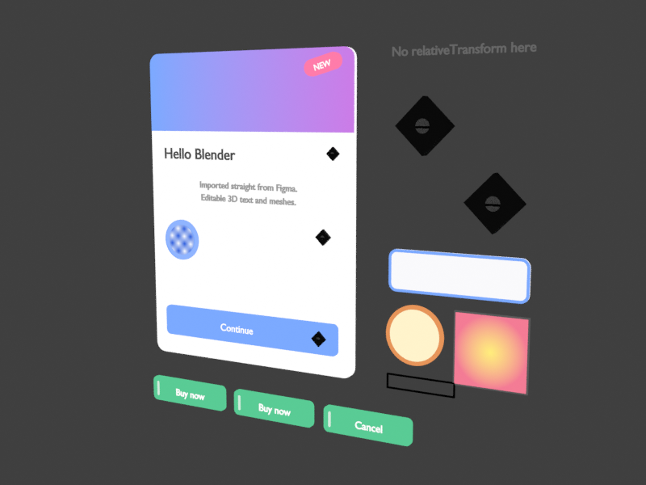

# Figma to Blender

A Blender add-on that imports a **Figma page, or a single frame, as editable 3D UI**: text becomes Blender text
objects, rectangles become planes with a *Corner Radius* Bevel modifier, ellipses become
filled curves, icons become SVG curves (or textured planes), image fills become textured
planes, and Figma frames/groups become parented Empties, so you can grab a whole card or menu
and move it in 3D. Gradient fills become shader-node gradients and strokes become a Geometry
Nodes outline. Everything is built [non-destructively](#non-destructive-by-design), and
[importing again](#re-import--sync) updates what is already there instead of duplicating it.

It talks to the Figma REST API directly from Blender (standard library only, no `requests`),
and the same pure-Python core also runs as a CLI so a page can be exported once to an offline
**scene bundle** (`scene.json` + `assets/`) and imported reproducibly later.



## Install

Download [`figma_to_blender-v0.3.0.zip`](../releases/figma_to_blender/figma_to_blender-v0.3.0.zip)
from the repo's `releases/` folder. Alternatively, every push and pull request to [this repo](../README.md) runs the
[Build add-ons](../.github/workflows/build-addon.yml) workflow, which runs the tests and uploads
the zip as the `figma_to_blender` artifact (GitHub ▸ *Actions* ▸ pick the run ▸ *Artifacts*).
To build it locally (standard library only, from the repo root):

```sh
python tools/build_zip.py --addon figma_to_blender   # -> ./dist/figma_to_blender.zip
```

**Requires Blender 5.0 or newer.** The add-on is a Blender extension: drag the zip into the
Blender window, or use *Edit ▸ Preferences ▸ Get Extensions ▸ ⌄ ▸ Install from Disk*. The zip
contains the `figma_to_blender/` folder with `blender_manifest.toml` inside it. Older Blender
versions are not supported.

*SVG curves* icon mode uses Blender's bundled SVG importer (`bpy.ops.import_curve.svg`, part of
Blender 5.0 and of the `bpy` 5.0 wheel); if a custom build lacks it, icons fall back to planes
with a warning.

## Get a Figma token

Figma ▸ account menu ▸ *Settings* ▸ *Security* ▸ *Personal access tokens* ▸ *Generate new token*
with the **File content: read** scope. Paste it into *Edit ▸ Preferences ▸ Add-ons ▸ Figma to
Blender ▸ Personal access token* (or set the `FIGMA_TOKEN` environment variable). You need at
least view access to the file you import.

## Use in Blender

Open the 3D Viewport sidebar (`N`) ▸ **Figma** tab.

1. Paste the file URL (`https://www.figma.com/design/<key>/...`) or bare file key.
2. **Fetch pages**, then pick a page from the dropdown. To import only one frame of that page,
   see [Import a single frame](#import-a-single-frame) below; leave **Frame** at *(whole page)*
   and **Node URL / ID** empty to import the whole page.
3. Choose options:
   - **Icons**: *SVG curves* or *Image planes* (see below).
   - **Orientation**: *Upright (XZ)*, the UI faces -Y like the front view, or *Flat (XY)*.
   - **Scale**: metres per Figma px (default `0.001`, a 360 px card is 36 cm wide).
   - **Depth step**: offset per element in draw order so overlapping shapes never z-fight
     (later-drawn = in front).
   - **Corner segments**: segments per rounded corner on the *Corner Radius* Bevel modifier
     (default 8; change it later per object in the modifier itself).
   - **Icon max size**, **Raster scale**, **Center at origin**.
   - **Update existing objects** (on by default): importing the same page/frame again updates
     the earlier import in place, see [Re-import / sync](#re-import--sync). **Delete removed
     elements** deletes objects whose Figma element disappeared instead of parking them.
4. **Import**. A new collection named after the page (or frame) appears, with one Empty per
   Figma frame/group and children parented to it. Every object carries `figma_id`,
   `figma_elem_id`, `figma_type`, `figma_name` custom properties; text records its Figma font
   family in `figma_font` (and the file the importer assigned in `figma_font_file`).

**Offline bundle** box: *Export bundle to folder* fetches the same page/frame/node without
building; *Import bundle* builds from a folder written earlier by the add-on or the CLI.

## Import a single frame

You do not have to import a whole page: any frame (or section, group, component, even a single
text or rectangle) can be imported on its own. Two ways, both in the **Figma file** box of the
panel:

1. **Frame dropdown.** After **Fetch pages** and picking the page, click **Fetch frames**. The
   **Frame** dropdown now lists the page's top-level layers (the first entry, *(whole page)*,
   imports everything as before). Pick a frame and press **Import**.
2. **Node URL / ID.** In Figma, select the frame and use *Copy link to selection*
   (right-click ▸ *Copy/Paste as* ▸ *Copy link to selection*, or `Ctrl/Cmd+L`). Paste the link
   into **Node URL / ID (optional)** and press **Import**. Figma writes the node id as
   `node-id=12-345` in URLs; the add-on converts it to `12:345`. A bare id (`12:345`, as shown
   by Figma's dev mode or the CLI's `--list-frames`) works too. This field works for nodes at
   any depth, not only top-level frames, and while it is non-empty it overrides both dropdowns.
   An unreadable value stops the import with an error instead of falling back to the page.

The imported frame gets its own collection named after it. Its **top-left corner is placed at
the origin** (`0, 0`) and its children move with it, so the frame's position on the Figma page
does not leak into Blender; the frame's own rotation is kept, so a tilted frame imports tilted,
just as on the canvas. The frame's fill and corner radius become its background plane like any
other frame. *Center at origin* still applies afterwards if you prefer the frame centred.
*Export bundle to folder* honours the same selection; in `scene.json` the root node is recorded
in `page_id` / `page_name` (kept for compatibility) plus `root_type` (`CANVAS` for a page,
`FRAME`, `SECTION`, ... otherwise).

The operator prints a summary (counts per kind, sync tallies, fonts not found, warnings) to the
status bar and full warnings to the system console.

## Re-import / sync

Iterate in Figma and press **Import** again: with **Update existing objects** on (the default)
the add-on looks for the collection of the earlier import (same name and the same page/frame
id stored in `figma_page_id`) and updates its objects in place instead of creating a
`Page 1.001` copy. Objects are matched by the `figma_elem_id` custom property (objects imported
by v0.2 are matched through `figma_id`), so you can rename them freely.

**What follows Figma** (the design is the source of truth):

- position, rotation, flip, depth offset and parenting of every object;
- a rectangle's / image plane's size: the plane's four vertices move, the mesh datablock and
  every modifier on it stay; the *Corner Radius* modifier's width, per-corner weights and
  segments;
- an ellipse's size through its four control points;
- text: body, size, alignment, line spacing, letter spacing, text box, colour; the font, unless
  you assigned another font yourself since the last import (the importer remembers what it
  assigned in `figma_font_file`);
- image planes swap to the new image when the rendered asset changed (content hash);
- SVG icons re-import their curves when the SVG changed and keep them otherwise; the parent
  Empty always survives;
- materials the importer created (they carry a `figma_managed` property and are shared per
  colour / gradient) follow the new fill, gradient and stroke; the *Stroke* modifier is added,
  updated or removed to match.

**What is preserved**: modifiers you added, materials you assigned in place of the importer's,
custom properties you set, object names you changed, the font you picked. A mesh or curve you
edited into something else is replaced by a fresh plane / ellipse (with a warning), because
its size can no longer be applied.

**Removed elements**: objects whose Figma element no longer exists are moved into a
`<collection> (removed)` sub-collection (SVG icon curves go with their Empty) so nothing is
lost; with **Delete removed elements** they are deleted instead. An element whose type changed
(a rectangle turned into an ellipse) is treated as removed + new. The report shows
`sync: created N, updated N, moved N, removed N`. Turn **Update existing objects** off to get
the old behaviour (always a fresh collection). *Import bundle* syncs the same way.

## CLI

Runs with plain CPython 3.8+ (no Blender needed):

```sh
export FIGMA_TOKEN=figd_...
python -m figma_to_blender.cli --file https://www.figma.com/design/<key>/Name --list-pages
python -m figma_to_blender.cli --file <key> --page "Page 1" --out ./bundle \
    --icon-format svg --raster-scale 2 --icon-max-size 128

# single frame: list a page's top-level frames (id, type, name), then export one by id or by URL
python -m figma_to_blender.cli --file <key> --page "Page 1" --list-frames
python -m figma_to_blender.cli --file <key> --node 12:345 --out ./card
python -m figma_to_blender.cli --file <key> --node "https://www.figma.com/design/<key>/Name?node-id=12-345" --out ./card
```

`--node` and `--page` are mutually exclusive; `--node` skips the page listing entirely and puts
the node's top-left corner at the origin, exactly like the add-on's **Node URL / ID** field.

Then in Blender: *Offline bundle ▸ Import bundle* pointing at `./bundle`, or from a script:

```python
import sys; sys.path.append("/path/to/repo")
from figma_to_blender import builder
report = builder.build_bundle("./bundle", builder.BuildOptions(icon_mode="SVG"))
print(report.summary())
```

## Non-destructive by design

Whatever Blender can express as an object property, modifier or curve parameter is **not**
baked into geometry, so you can keep tweaking after import:

| Figma | Blender | Where to edit |
|---|---|---|
| Rectangle / frame fill | 4-vertex plane at the node size, object scale 1 | mesh stays a sharp quad |
| Corner radius (`cornerRadius`, `rectangleCornerRadii`) | **Bevel modifier** *Corner Radius*: vertices only, `width` = largest radius, per-corner ratio stored as vertex bevel weight (tl, tr, br, bl), segments from *Corner segments* | modifier panel (width / segments), vertex bevel weights for per-corner radii; every rect carries the modifier even at radius 0 so you can dial one in |
| Ellipse | filled **2D Bezier curve** (4 aligned points, resolution 24), sized through its control points | curve edit mode, `Resolution Preview U` |
| Image fill | plane with an image texture material (+ the same Bevel modifier when the node has radii) | material nodes / modifier |
| Icon (SVG mode) | the importer's curve objects, untouched, under an Empty whose **object transform** scales the SVG to the node size | move / scale the Empty; the curves are the raw SVG paths |
| Position, rotation, flip | object `matrix_world` (rotation on the object, never in the mesh) | N panel |
| Fill colour, opacity | emission material shared per colour | material |
| Gradient fill (linear, radial, angular, diamond) | **shader nodes**: Texture Coordinate (UV; *Generated* for ellipse curves) → Mapping (from the gradient handles) → Gradient Texture → Color Ramp (the stops, colour + alpha) → Emission; one material per gradient | Mapping node (move/rotate the gradient), Color Ramp (recolour / add stops) |
| Stroke (`strokes[0]`, `strokeWeight`, `strokeAlign`) | **Geometry Nodes modifier** *Stroke* using the shared *Figma Stroke* node group: outlines the evaluated shape (after the bevel), Width = weight × scale, Align = INSIDE / CENTER / OUTSIDE, Material = flat stroke colour, Lift above the fill | modifier inputs (width, align, material); disable or delete it to drop the stroke |
| Text | Blender text object (`size`, `align_x/y`, `space_line`, `space_character`, text box) | data properties |

Still baked, because Blender has no parameter for it: the plane's *size* (a plane is its four
vertices; scaling the object instead would distort the bevel), the ellipse's *size* (curve
control points, kept editable), and the text baseline offset (a translation in the object
matrix that compensates Blender's TOP alignment). Effects are not imported (see Limitations).

### Gradients

The first visible fill is used. Figma's `gradientHandlePositions` are normalised to the node
box, so the plane's 0..1 UVs map them exactly: handle 0 is the Mapping node's location,
handle 0 → handle 1 its rotation and scale (the 0..1 axis of the Gradient Texture), and for
radial / diamond gradients handle 2 sets the second axis. Linear uses `LINEAR`; radial uses
`SPHERICAL` inverted (Blender's is 1 at the centre); angular uses `RADIAL` remapped to sweep
clockwise from handle 1; diamond is `|x| + |y|` from math nodes because Blender has no diamond
type. Stops beyond 32 (Blender's Color Ramp limit) are dropped. Ellipses are curve objects
without UVs, so they use *Generated* coordinates (their bound box), which is the same box as
long as no stroke sticks out of it (an approximation for outside/centre strokes). Text keeps a
single colour, the average of the stops (`figma_fill_approx` marks it).

### Strokes

Rectangles, frame backgrounds, image planes and ellipses with a visible solid `strokes[0]` and
`strokeWeight > 0` get the *Stroke* modifier (a gradient stroke is averaged to one colour, a
node with a stroke but no fill imports with a fully transparent fill). Inside the *Figma
Stroke* group: Edge Neighbors = 1 selects the boundary edges → Mesh to Curve (an ellipse curve
passes straight through) → Resample Curve (*Evaluated*) → Set Curve Normal (*Z Up*, so the
profile lies in the shape's plane) → Set Position moves the outline by ± width / 2 for the
alignment → Curve to Mesh sweeps a straight profile of length Width, scaled by the mitre
factor at corners so sharp rectangles get square outer corners → Set Material → Join Geometry
with the original shape, so the fill face stays. Strokes on text and icons are not imported
(one warning); the *Corner Radius* bevel feeds the stroke, so rounded corners get a rounded
outline automatically.

## How it works

```
Figma REST API ──► figma_api.py ──► scene_model.py ──► scene.json + assets/ ──► builder.py ──► Blender objects
                   (urllib only)     (pure Python)        (the "bundle")          (bpy)
```

- `GET /v1/files/{key}?depth=1` lists pages; `GET /v1/files/{key}/nodes?ids=<page>&depth=1`
  lists a page's top-level frames; `GET /v1/files/{key}/nodes?ids=<page-or-frame>&geometry=paths`
  fetches the tree with `size` + `relativeTransform`, which are composed down from the root
  so nested and rotated frames land where Figma shows them (falls back to
  `absoluteBoundingBox` when missing). For a single-frame import the root's translation is
  cancelled so its corner sits at the origin (`scene_model.root_origin_matrix`).
- Icons and image fills are rendered by `GET /v1/images/{key}` in batches of 40 with retry/backoff
  on 429; a failed render is logged and skipped, never fatal.
- `scene.json` is a flat draw-ordered list of `text | rect | ellipse | icon | image | group`
  elements with world transform, size, first visible fill (`fill`, plus `fill_gradient` with
  type / stops / handles for a gradient), first stroke (`stroke_rgba`, `stroke_weight`,
  `stroke_align`), opacity, corner radii and text style.

### Icon detection and SVG vs planes

A node is an icon when it is a `VECTOR`, `BOOLEAN_OPERATION`, `STAR`, `LINE` or
`REGULAR_POLYGON`, **or** a `GROUP`/`FRAME`/`INSTANCE`/`COMPONENT` no larger than *Icon max
size* (default 128 px) whose descendants are all vector-like (no text, no image fills). Icons
are exported as one unit and their children are not imported separately. Everything larger
recurses into its children as a group. A node whose first visible fill is an image is imported
as an image plane.

| | SVG curves | Image planes |
|---|---|---|
| Editable / extrudable | yes, real curve objects | no |
| Resolution | independent | fixed (`raster scale` × node size) |
| Gradients, shadows, blend modes | lost (flat fills only) | pixel-perfect |
| Scene weight | heavy for complex icons | one quad + texture |

Curves come from Blender's bundled SVG importer. The add-on does not trust its 90 dpi scale:
it measures the importer's px→metre factor once, then scales each icon so the SVG viewBox
matches the node size exactly (falling back to bounding-box fitting for SVGs without a
viewBox). If the importer is unavailable, icons fall back to planes with a warning.

## Limitations (v0.3)

- Only the first visible fill and the first stroke of a node are used; gradient *strokes* and
  text gradients are averaged to one colour (`fill_approx` / `figma_fill_approx`); dashed
  strokes, per-side stroke weights (reduced to the largest side) and stroke caps/joins are
  not imported; strokes on text and icons are skipped.
- Effects (shadows, blurs), blend modes and masks are not imported (they do survive inside PNG
  icons/images).
- Fonts must be installed locally; the add-on matches by PostScript name, then family + weight.
  Otherwise Blender's default font is used and the family is recorded in `figma_font`.
- Text vertical metrics are approximated (ascender ≈ 0.8 em); mixed styles within one text
  node (`characterStyleOverrides`) are not supported, the whole node uses its base style.
- Component variants and instances are imported as they appear; auto-layout is baked to
  absolute positions (as the API reports them).
- Only the first visible fill of each node is used; `clipsContent` is ignored.

## Roadmap

- Drop shadows as translucent planes, dashed strokes.
- Per-run text styling from `characterStyleOverrides`.
- Extrude presets (depth per kind).
- Resurrect an element from the *(removed)* collection when its id comes back.

## Development

All commands run from the repository root (this add-on lives in `figma_to_blender/`, next to the
other add-ons in [arthovis-org/BlenderAddons](../README.md)):

```sh
python -m unittest discover -s figma_to_blender/tests -t .   # pure-python tests (fixture in tests/fixtures), also run in CI
pip install bpy && python -m pytest figma_to_blender/tests/  # also runs the builder tests (bpy 5.0 wheel, Python 3.11)
FIGMA_RENDER_OUT=render.png python -m pytest figma_to_blender/tests/test_builder_bpy.py -k render
python tools/build_zip.py --addon figma_to_blender          # the same zip CI uploads
```

The bpy tests build the fixture page in both icon modes and assert object counts, types,
positions, rotation, parenting, materials, the SVG icon's bounding box, the *Corner Radius*
Bevel modifier (width, segments, per-corner vertex weights, evaluated vertex count), the
ellipse curve (2D, fill BOTH, dimensions), a single-frame import (collection named after the
frame, background plane cornered at the origin, only the subtree built), the gradient
material node trees, the *Stroke* modifier (evaluated extents per alignment, shared node
group) and re-import: a no-op second import, Figma edits applied in place while user
modifiers / materials / properties survive, removed elements parked, legacy objects matched.

## License

MIT, see [LICENSE](LICENSE).
